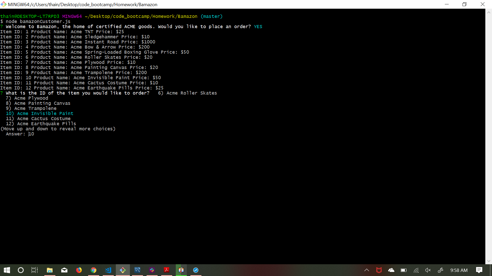

# Welcome to Bamazon, your source for certified ACME goods

## Description

Bamazon is a command line store front utilizing MySQL and Node.js. 

## How to use

To place an order, simply type node bamazonCustomer into the terminal. The app will then ask you which item you would like to purchase and the quanitity of the item. It will then display your total or notify you if there is not enough of the item in stock. It will then return you to the storefront.

## Tech Used

* JavaScript
* Node.js
* MySQL
* Inquirer

## Screenshots

Here are some screenshots demonstrating how the Bamazon storefront works:

Welcome Screen

Select an item to order:

Select the quantity of the item:

When the order is placed, the app returns to the storefront:

Updated database reflecting order placed:

# Introducing Bamazon Manager, your management solution for certified ACME goods

## Description

Bamazon Manager allows you to manage your storefront by viewing your current products for sale, viewing your inventory, adding to your inventory and adding new products. To use Bamazon Manager, simply type node bamazonManager into the terminal.

## Screenshots

Here are some screenshots demonstrating how the Bamazon Manger app works:

Welcome screen:

View products for sale:

View low inventory to display products with stock quantity below 5:

Add to inventory:

Add a new product:

Updated database displaying new product:

